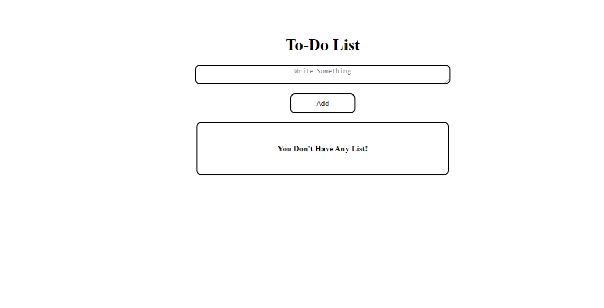
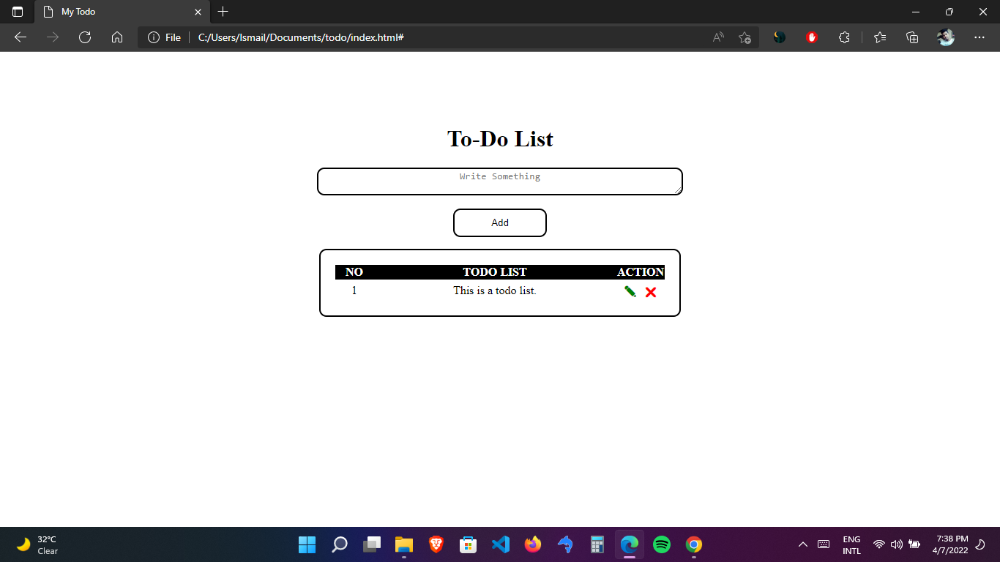

# todo-list-pure-javascript

This is a simple To-Do list web application using HTML, CSS and JavaScript. It is made of only using javascript pure functions. I know there are lots of ways of making todo list. Anyone can read and understand the code who have basic knowledge of JavaScript. 
